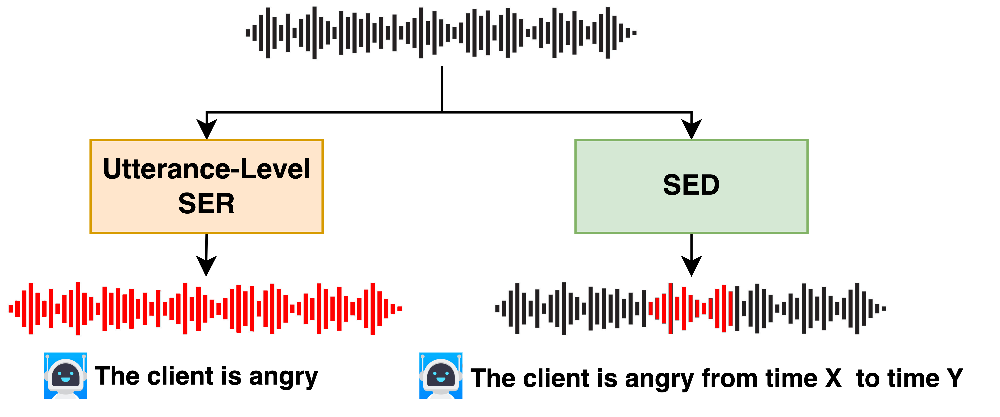
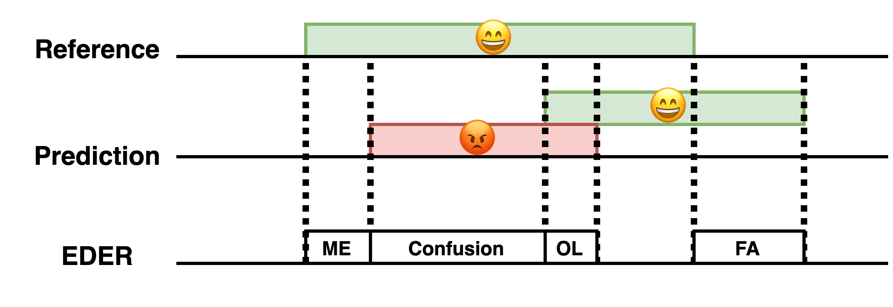

# Speech Emotion Diarization (SED)

Speech Emotion Diarization ([arXiv link](to be added)) aims to predict the correct emotions and their temporal boundaries with in an utterance. 

Another implementation will soon be made available on [SpeechBrain](https://github.com/speechbrain/speechbrain).

## Dependencies

The implementation is based on the popular speech tookit [SpeechBrain](https://github.com/speechbrain/speechbrain). 

To install the dependencies, do  `pip install -r requirements.txt`

## Datasets

### Test Set
The test is based on Zaion Emotion Database (ZED), which can be downloaded [here](to be added).

### Training Set Preparation
1. RAVDESS: https://zenodo.org/record/1188976/files/Audio_Speech_Actors_01-24.zip?download=1

   Unzip and rename the folder as "RAVDESS".

2. ESD: https://github.com/HLTSingapore/Emotional-Speech-Data

   Unzip and rename the folder as "ESD".

3. IEMOCAP: https://sail.usc.edu/iemocap/iemocap_release.htm

   Unzip.

4. JL-CORPUS: https://www.kaggle.com/datasets/tli725/jl-corpus?resource=download

   Unzip, keep only `archive/Raw JL corpus (unchecked and unannotated)/JL(wav+txt)` and rename the folder to "JL_corpus".

5. EmoV-DB: https://openslr.org/115/

   Download `[bea_Amused.tar.gz, bea_Angry.tar.gz, bea_Neutral.tar.gz, jenie_Amused.tar.gz, jenie_Angry.tar.gz, jenie_Neutral.tar.gz, josh_Amused.tar.gz, josh_Neutral.tar.gz, sam_Amused.tar.gz, sam_Angry.tar.gz, sam_Neutral.tar.gz]`, unzip and move all the folders into another folder named "EmoV-DB".

## Metric

A proposed Emotion Diarization Error Rate is used to evaluate the baselines.

The four components are:

1. False Alarm (FA): Length of non-emotional segments that are predicted as emotional.
2. Missed Emotion (ME): Length of emotional segments that are predicted as non-emotional.
3. Emotion Confusion (CF): Length of emotional segments that are assigned to another(other) incorrect emotion(s).
4. Emotion Overlap (OL): Length of non-overlapped emotional segments that are predicted to contain other overlapped emotions apart from the correct one

## Run the code

Model configs and experiment settings can be modified in `hparams/train_with_wav2vec.yaml`.

To run the code, do `python train_with_wav2vec.py hparams/train_with_wav2vec.yaml`.

The data preparation may take several hours.

A `results` repository will be generated that contains checkpoints,  logs, etc. The frame-wise classification result for each utterance can be found in `cer.txt`.

## Inference

The pretrained models and a easy-inference interface can be found on [HuggingFace](to be added).
